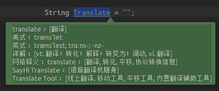

TranslatePlugin
===============

### JetBrains IDE 翻译插件

介绍
---
- 使用网易有道翻译API
- 支持中英文互翻
- 支持鼠标右键选词翻译
- 操作简单（快捷键）<kbd>Alt</kbd> + <kbd>Shift</kbd> + <kbd>Z</kbd>

### 安装步骤:

1、下载插件包[Translate.zip](https://raw.githubusercontent.com/ZoolYe/Translate/master/translate-0.3.zip)

2、<kbd>File</kbd> > <kbd>Settings</kbd> > <kbd>plugins</kbd> > <kbd>Install plugin from disk...</kbd> > <kbd> OK</kbd>

3、Restart IDEA(重启IDEA)